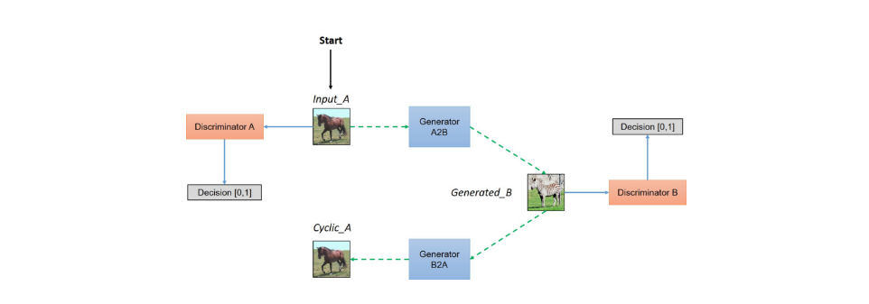
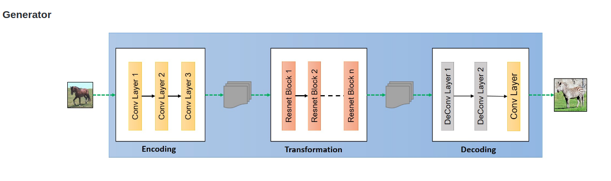
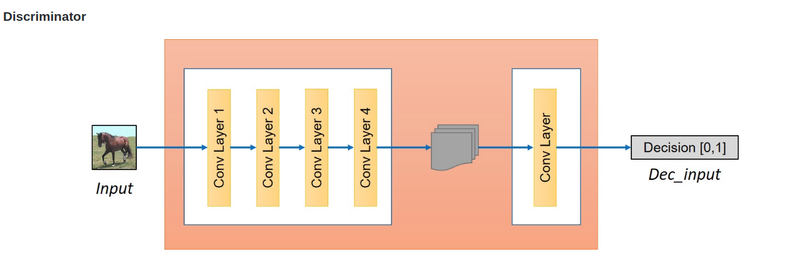

# CycleGAN
  An tensorflow Implement of CycleGAN

## Framework
  - Picture below shows the framework of CycleGAN, more details can be seen in this repo.
  
  

  

  
  - Picture below shows the generator, more details can be seen in this repo. 
  
  

  
  - Picture below shows the discriminator, more details can be seen in this repo
  

  
  
# Requirement
  
  tensorflow 1.3.0
  
  python 2.7.12
  
  numpy 1.13.1
  
  scipy 0.17.0
  
# Usage
  (1)download this repo to your own directory
  
    $ git clone https://github.com/nnUyi/CycleGAN.git
    $ cd CycleGAN
    
  (2)download [dataset](https://people.eecs.berkeley.edu/~taesung_park/CycleGAN/datasets/) and store it in the datasets directory(directory named datasets) and then unzip it. You can use any datasets downloaded from the [website](https://people.eecs.berkeley.edu/~taesung_park/CycleGAN/datasets/).
  
  (3)training
  
    $ python main.py --is_training=True
    
  (4)sampling
    Sampling process is executed in training time. You can see the sampling results in the directory named sample

# Experiments
  The result shows below, after 15 epoches, we can clearly obtain such a good experimental result.
  
  

# Reference

  This repo is finished by referring to [xhujoy/CycleGAN-tensorflow](https://github.com/xhujoy/CycleGAN-tensorflow)
  
# Contacts
  
  Email:computerscienceyyz@163.com, Thank you for contacting if you find something wrong or if you have some problems!!!

